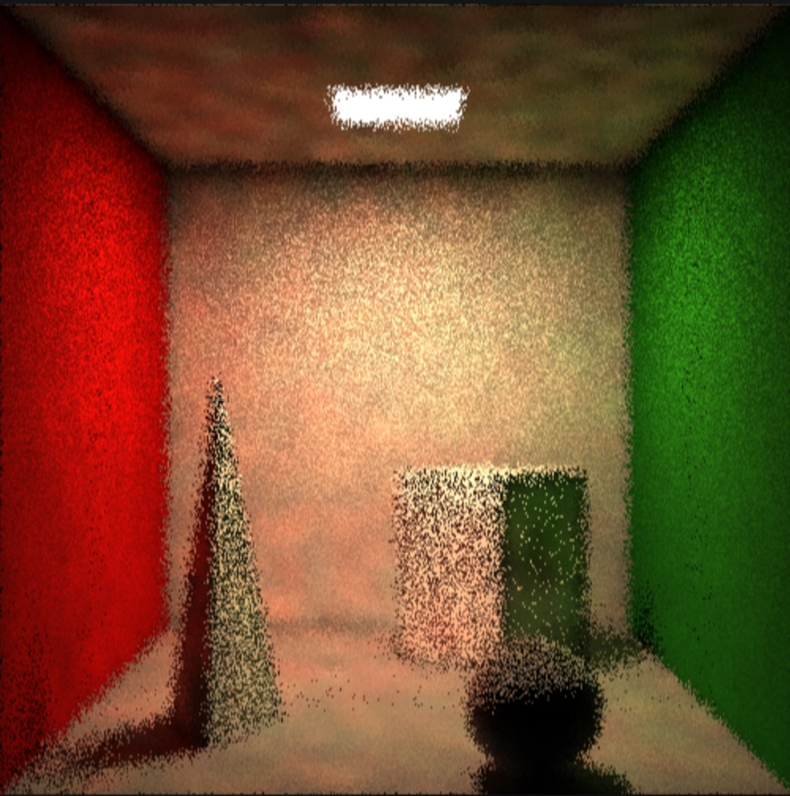
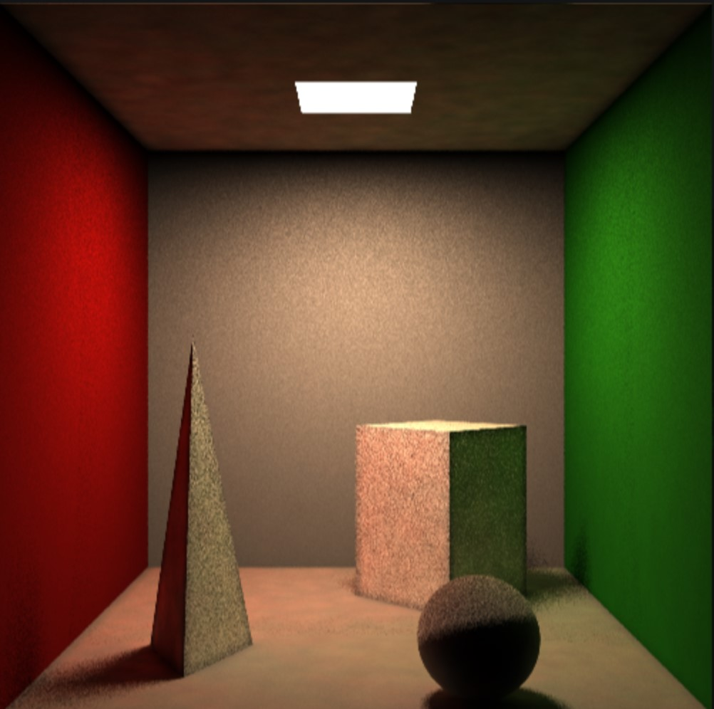
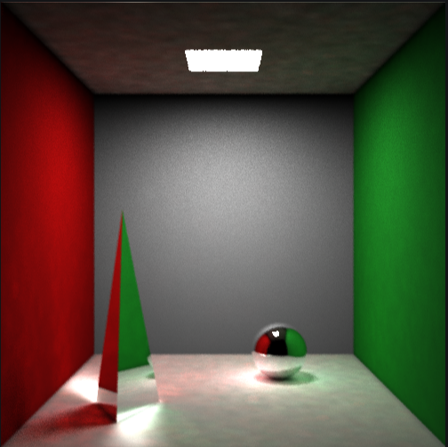
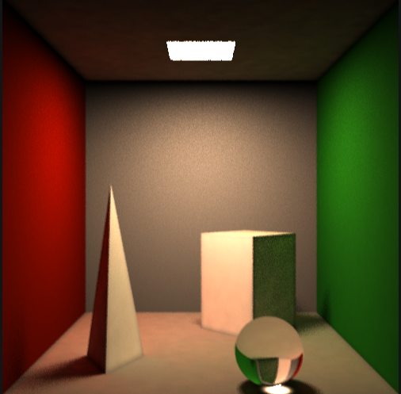
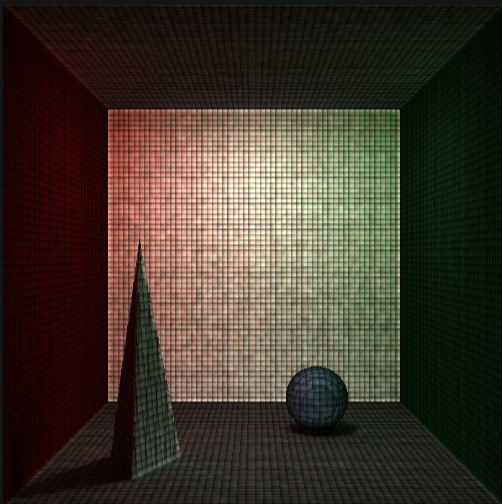
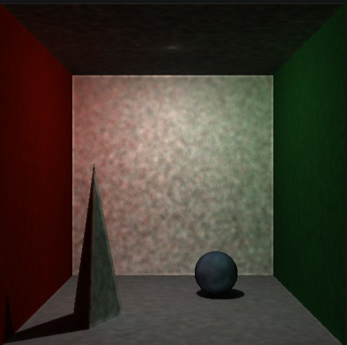
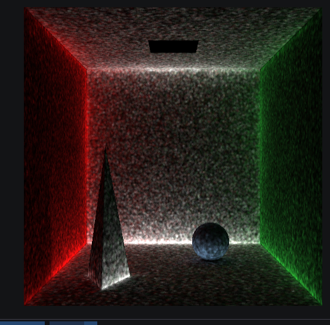

# 随机渐进光子映射算法

代码仓库(DDL之后设为公开)： https://gitee.com/AQgit/nrenderer

实验实现内容：
- **渲染算法**：随机渐进光子映射(SPPM)
- **材质**：金属、绝缘体
- **几何**：KD-Tree求交优化

## 算法描述

### 随机渐进光子映射算法

随机渐进光子映射算法[^sppm]（Stochastic Progressive Photon Mapping，SPPM）的每次迭代分如下几个步骤：

1. 从相机发射路径以获得可视点（Visible Point）。每个像素获得一个可视点，同时计算像素的直接光照。
2. 使用网格（Grid）对所有可视点进行索引；
3. 光源随机发送光子，并在场景中传播，光子被累加到命中的可视点中；
4. 通过可视点捕获的光子计算像素的**间接光照**，并收缩的捕获半径。

详细的理论推导和实现思路参考了作者原论文[^sppm]和《PBRT》 [^pbrt]。这里不展开说明理论推导，重点关注实现过程中的几个问题。

第一，在相机发射路径时，随机渐进光子映射与渐进光子映射算法不同的一点就是要加一个随机偏移，才能够比较好地消除噪声，实现景深的效果。

第二，使用网格（Grid）获得附近可视点后，要根据可视点表面法向和光子命中点表面法向判断是否在同一表面上。光子应只考虑给同一表面上的可视点送光，否则会导致表面交界处亮度比其他位置高，产生条带。

第三，光源发送光子，应区分实现传播方向和光线传播方向的不同。

第四，保持能量守恒。光子传播时能量应不断衰减，最后计算间接光照时，需要除以光子总数，否则发射光子越多，场景越亮。


### 金属材质
金属材质是一种近似镜面反射的材质，光照射到金属材质表面后会向着一个方向进行小范围的反射，而不像漫反射那样几乎可以反射到空间上的任何位置。

由理想镜面反射材质构成的金属是非常特殊的一种材质，因为它可以完全将光线按照反射定律反射。其中计算反射光线的方向的函数如下：

```c++
static Vec3 reflect(const Vec3& normal, const Vec3& dir) {
	return dir - 2 * glm::dot(dir, normal) * normal;
}
```

根据反射定律（反射角等于入射角）可以很轻松的通过向量运算求得。

下面我们需要完成所必须的两个shade函数，一个用于计算相应的颜色值，另一个用于记录光线散射方向、衰减及概率分布等等参数：

```c++
RGB Conductor::shade(const Vec3& in, const Vec3& out,
                     const Vec3& normal) const {
  return diffuseColor;
}

Scattered Conductor::shade(const Ray& ray, const Vec3& hitPoint,
                           const Vec3& normal) const {
  Vec3 origin = hitPoint;
  Vec3 direction = glm::reflect(ray.direction, normal);
  float pdf = 1;
  auto attenuation = diffuseColor;
  return {Ray{origin, direction}, attenuation, Vec3{0},false, pdf};
}
```

由于是镜面反射，其光线的概率分布是恒定的, 同时考虑到金属本身的颜色，会在光线照射时反射对应颜色，因衰减等于diffuseColor.

但是大多数的金属并不完全是镜面反射的，往往会朝着某一方向上集中反射，我们考虑在理想反射上添加一个单位随机变量，通过fuzz_size参数来控制反射的集中程度：

```c++
RGB Conductor::shade(const Vec3& in, const Vec3& out,
                     const Vec3& normal) const {
  Vec3 random = defaultSamplerInstance<UniformInSphere>().sample3d();
  Vec3 fuzz = Vec3(fuzz_size, fuzz_size, fuzz_size);
  Vec3 r = glm::normalize(reflect(normal, out) +fuzz * random);
  auto specular = diffuseColor * (1-glm::dot(glm::normalize(in), r));
  return specular;
}

Scattered Conductor::shade(const Ray& ray, const Vec3& hitPoint,
                           const Vec3& normal) const {
  Vec3 origin = hitPoint;
  Vec3 direction = glm::reflect(ray.direction, normal);

  float pdf = fuzz_size;

  auto attenuation = diffuseColor*Vec3(1-fuzz_size, 1 - fuzz_size, 1 - fuzz_size);

  return {Ray{origin, direction}, attenuation, Vec3{0},false, pdf};
}
```

在理想反射的基础上添加了随机向量后，可以使得金属表面更加模糊，产生金属表面的效果。

### 绝缘体材质

绝缘体材质是可以进行光线透射的材质，例如玻璃。具体而言，绝缘体材质是满足光的折射定律的材质，它不仅会根据入射光线和出射光线所在材质的折射率来进行光线折射，还会在折射角大于$90^{\circ}$的时候发生全反射现象。

我们在Dielectric类中用ratio_index来描述介质的折射率，默认空气中折射率为1.而玻璃的折射率一般在1.5-1.6左右，首先我们还需要写出求光的折射光线方向的函数：

```c++
static Vec3 refract(const Vec3& in, const  Vec3& normal, double refract_rate) {
    //根据菲涅尔定律 进行变形 将折射后的光线分解为垂直发现方向和平行法线方向分别计算，最后再相加
    double cos_theta = clamp(dot(-in, normal), -1.0, 1.0);
    Vec3 Cos = Vec3(cos_theta, cos_theta, cos_theta);
    
    Vec3 out_perp = Vec3(refract_rate,refract_rate,refract_rate) * (in + Cos * normal);
    double temp = -sqrt(abs(1.0 - dot(out_perp, out_perp)));
    Vec3 out_para =Vec3(temp,temp,temp) * normal;
    Vec3 out = out_perp + out_para;
    return out;
}
```

我们还需要计算计算折射角，并根据折射角来判断发生折射还是全反射：

```c++
Scattered Dielectric::shade(const Ray& ray, const Vec3& hitPoint,
        const Vec3& normal) const {
        auto attenuation = Vec3(1.0, 1.0, 1.0);
        //判断光线是否在物体内部
        bool isOut = false;
        if (glm::dot(ray.direction, normal) < 0.0) {
            isOut = true;
        }
        float refract_ratio = isOut ? (1.0 / refract_index) : refract_index;
        Vec3 nownormal = isOut ? normal : -normal;
        //判断是否发生全反射
        float cos_theta = clamp(glm::dot(-glm::normalize(ray.direction), nownormal), 1.0, -1.0);
        float sin_theta = sqrt(1.0 - cos_theta * cos_theta);
        Vec3 outDirection;
        if (refract_ratio * sin_theta > 1.0  /* || reflectance(cos_theta, refract_ratio) > rand() / (RAND_MAX + 1.0)*/) {
            //全反射
            outDirection = glm::reflect(glm::normalize(ray.direction), nownormal);
        }
        else {
            //折射
            outDirection = glm::refract(glm::normalize(ray.direction), nownormal, refract_ratio);
        }
        float pdf = 1.0;
        return { Ray{hitPoint, outDirection}, attenuation, Vec3{0}, pdf };
    }
```

至此，我们在shadeCreator中添加绝缘体材质的支持即可。

### KD-Tree求交优化

在进行一般的光线求交时，我们往往需要遍历所有的物体和模型，分别进行光线求交运算，记录HitRecord后返回距离光线最近那个物体，这种线性的时间代价会大大拖慢图片渲染的速度。因此我们可以考虑使用KD-Tree来进行求交优化。

BVH(Bounding Volume Hierarchy Based On Tree)，及包围盒树是一种KD树。它首先为每一个物体构建AABB包围盒。紧接着它将空间中的物体依次二分，构建BVH节点，每一个节点的包围盒是节点中所包含物体的所有包围盒的一种覆盖。

首先我们需要构建AABB包围盒类：

```c++
struct AABB {
public:
    Vec3 min_corner, max_corner;
    AABB() {}
    AABB(Vec3 min, Vec3 max) :min_corner(min), max_corner(max) {}
    static AABB cover(AABB box1, AABB box2); //计算两个包围盒的闭包  
};
```

使用两个对角线节点来描述包围盒，接下来需要构造每一个物体的包围盒。这里考虑到物体的使用量，我们只考虑球体和三角面片的包围盒构建:

```c++
//Sphere
virtual bool box(AABB& output_box) const  override{
            output_box = AABB(position - Vec3(radius, radius, radius), position + Vec3(radius, radius, radius));
            return true;
}
//Triangle
virtual bool box(AABB& output_box) const override {
    Vec3 min_corner = glm::min(glm::min(v1, v2), v3);
    Vec3 max_corner = glm::max(glm::max(v1, v2), v3);
    output_box = AABB(min_corner,max_corner);
    return true;
}
```

下面我们需要构建BVH节点，并根据节点建树:

```c++
struct  BVHNode : public Entity {
       public:
           shared_ptr<Entity> left;
           shared_ptr<Entity> right;
           AABB bouding_box;

           BVHNode();
           BVHNode(const vector<shared_ptr<Entity>>& list) : BVHNode(list, 0, list.size()) {};
           BVHNode(const std::vector<shared_ptr<Entity>>& src_objects, size_t start, size_t end) 		   {
               this->type = Type::BVHNODE;
               srand((int)time(NULL));
               auto objects = src_objects;//创建一个可以改动的vector 不改动原本的vector
               int axis = rand()%3;
               cout << "axis: " << axis << endl;
               //比较函数的函数指针
               auto compare = (axis == 0) ? compare_box_x :
                   ((axis == 1) ? compare_box_y :
                       compare_box_z);
               size_t object_num = end - start;
               cout << "start: " << start << " end: " << end << endl;
               //[start,end)左闭右开
               switch (object_num) {
               case 1:
                   left = right = objects[start];
                   break;
               case 2:
                   left = objects[start];
                   right = objects[start + 1];
                   if (!compare(objects[start], objects[start + 1]))swap(left, right);
                   break;
               default:
                   sort(objects.begin() + start, objects.begin() + end, compare);
                   auto mid = start + object_num / 2;
                   left = make_shared<BVHNode>(objects, start, mid);
                   right =make_shared<BVHNode>(objects, mid, end);
                   break;
               }
               AABB leftBox, rightBox;
               if (left->box(leftBox) && right->box(rightBox)) {
                   cout <<"leftBox: "<<leftBox.min_corner << "  " << leftBox.max_corner << endl;
               cout <<"rightBox: "<< rightBox.min_corner << "  " << rightBox.max_corner << endl;
                   bouding_box = cover(leftBox, rightBox);
               }
               else {
                   cerr << "No box error\n";
               }
           }
           virtual bool box(AABB& output_box) const override {
               output_box = bouding_box;
               return true;
           }
   };
```

我们在利用物体列表构建节点时，就完成了以该节点为根节点的BVH树的构建，之后我们将光线求交在树上跑即可：

```c++
HitRecord xBVHNode(const Ray& ray, const BVHNode& n, float tMin, float tMax){
            if (!xAABB(ray,n.bouding_box,tMin,tMax)) {
               return getMissRecord();
           }
           HitRecord hitLeft = nullopt;
           if (n.left->type ==Entity::Type::SPHERE) {
              auto sphere= (Sphere*)&(* n.left);
               hitLeft = xSphere(ray,*sphere, tMin, tMax);
           }
           else if (n.left->type == Entity::Type::TRIANGLE) {
               auto triangle = (Triangle*)&(*n.left);
               hitLeft = xTriangle(ray, *triangle, tMin, tMax);
           }
           else {
               auto bvh = (BVHNode*)&(*n.left);
               hitLeft = xBVHNode(ray, *bvh, tMin, tMax);
           }

           HitRecord hitRight = nullopt;
           if (n.right->type == Entity::Type::SPHERE) {
               auto sphere = (Sphere*)&(*n.right);
               hitRight = xSphere(ray, *sphere, tMin, hitLeft ? hitLeft->t : tMax);
           }
           else if (n.right->type == Entity::Type::TRIANGLE) {
               auto triangle = (Triangle*)&(*n.right);
               hitRight = xTriangle(ray, *triangle, tMin, hitLeft ? hitLeft->t : tMax);
           }
           else {
               auto bvh = (BVHNode*)&(*n.right);
               hitRight = xBVHNode(ray, *bvh, tMin,hitLeft ? hitLeft->t : tMax);
           }

           if(hitRight) return hitRight;
           return hitLeft;
   }
```

启用后即可实现光线求交加速。

## 实验结果

### 渲染漫反射材质

|      迭代1次       |        迭代16次        |
| :------------------------: | :-----------------------------: |
|  |  |


### 渲染金属材质与绝缘体材质

| 渲染金属材质       | 渲染绝缘体材质     |
| ------------------ | ------------------ |
|  |  |

### 程序性能

#### 并行渲染

对渲染进行了并行化，每次迭代耗时如下：

|       过程       | 一般用时/ms | 并行用时/ms |
|:----------------:|------------:|------------:|
|     视线投射     |         220 |          40 |
|     构建格点     |         558 |         --- |
| 追踪光子(iter=1) |        7441 |        2085 |
| 追踪光子(iter=8) |        1538 |         439 |

消除锁、对构建格点进行并行，程序运行还能再快一点，但是不是实验重点，不再深究。

#### KDTree求交优化

| 过程             | 一般用时/ms | KD-Tree用时/ms |
| ---------------- | ----------- | -------------- |
| 视线投射         | 220         | 201            |
| 构建格点         | 558         | ---            |
| 追踪光子(iter=1) | 7441        | 6826           |
| 追踪光子(iter=8) | 1538        | 1487           |

由于实际测试用例物体数量和复杂度不够高，因此提升效果一般，当物体数量较多时，加速效果会更加明显.

## 实验过程中遇到的问题

### PPM渲染结果出现网格



这是由于编程疏忽所产生的BUG，相关代码(如下)处i,j,k边界应取"<="。具体原因是格点分界点处的`visable point`恰好不能被周围
格点索引。完整代码见`git checkout grid_img`。 

```cpp
// 函数: sppm::Grid::insert
for (uint i = min_grid[0]; i < max_grid[0]; i++)
  for (uint j = min_grid[1]; j < max_grid[1]; j++)
    for (uint k = min_grid[2]; k < max_grid[2]; k++)
      vp_lists_[id({i, j, k})].push_front(svp);
```

### BackWall过亮



出现该问题的原因是，直接照搬了RayCast组件中的Shader，其参数中in和out均指的是视线传播方向。而在PPM中我将之按光线传播方向使用，所以与视线垂直的后墙过亮。完整代码见`git checkout backwall`。


### 角落间接光照过亮



问题出在光子漫反射材料上的传播。设入射角为α，出射角为β，问题原因解释如下。光子映射对于漫反射材料其实本身不用乘入射cos(α)（斜着的平面接受的光子数量与投影面积成正比，等效包含了cos系数），反而需要乘cos(β)(因为发射光子的强度要考虑投影面积的大小)。含bug的代码见`git checkout corner_bug`，修改后的间接光照如下。

## 实验感受

通过上手实现，发现了许多理解上的偏差，通过对bug和理论的反复揣摩，对随机间接光子映射的理解更加明晰。


[^sppm]: Hachisuka T, Jensen H W. Stochastic progressive photon mapping[M]//ACM SIGGRAPH Asia 2009 papers. 2009: 1-8.
[^pbrt]: [Stochastic Progressive Photon Mapping (pbr-book.org)](https://pbr-book.org/3ed-2018/Light_Transport_III_Bidirectional_Methods/Stochastic_Progressive_Photon_Mapping)
